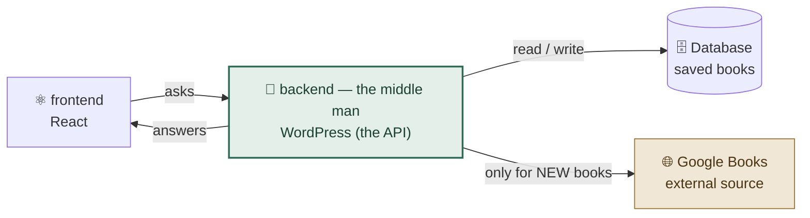
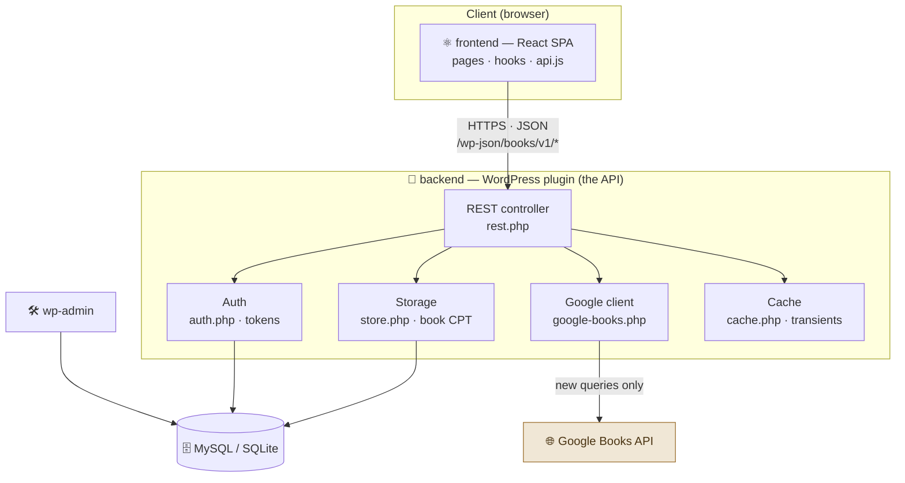
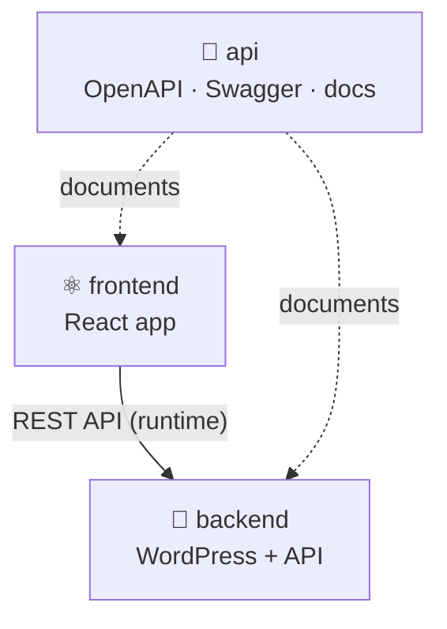
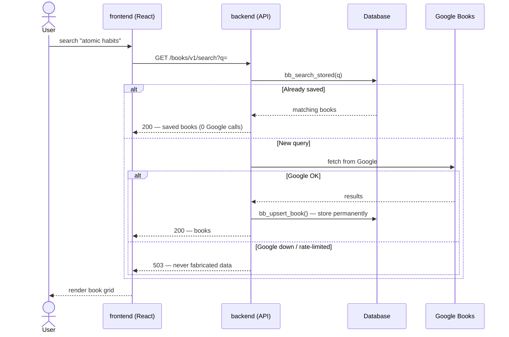
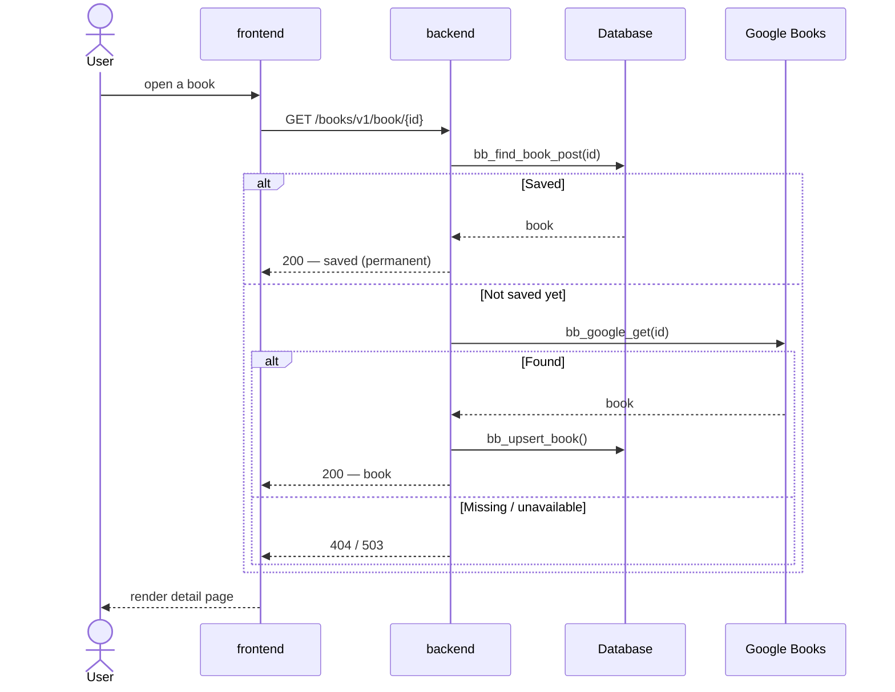
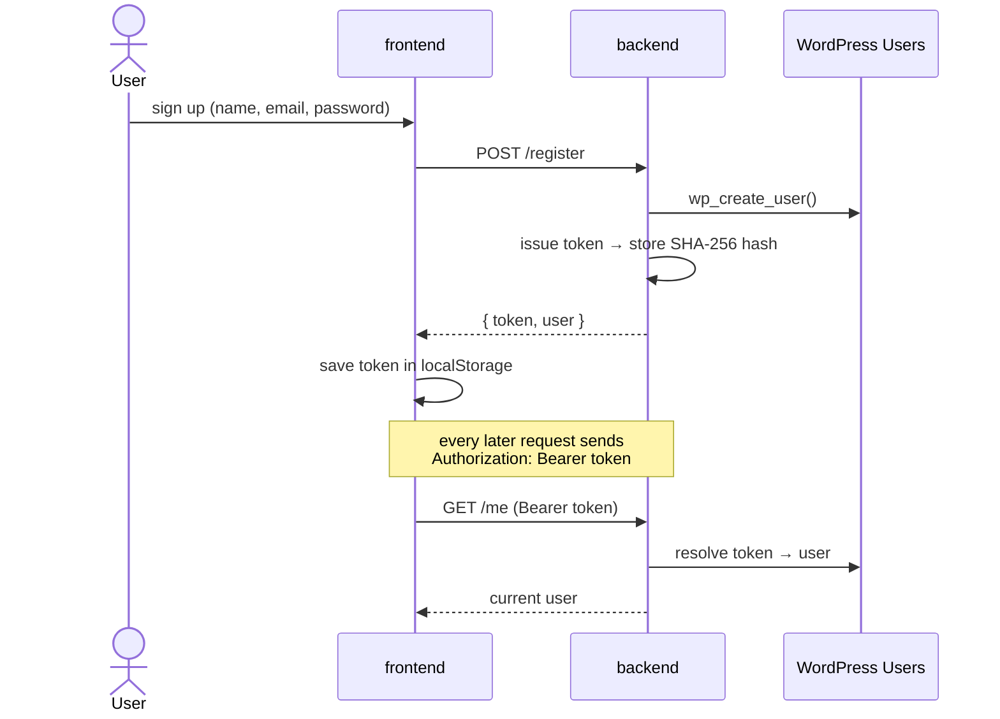
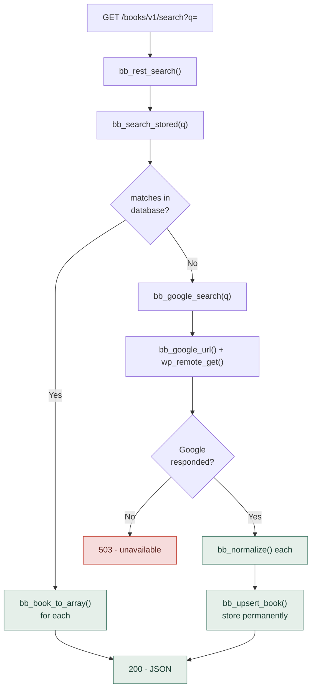
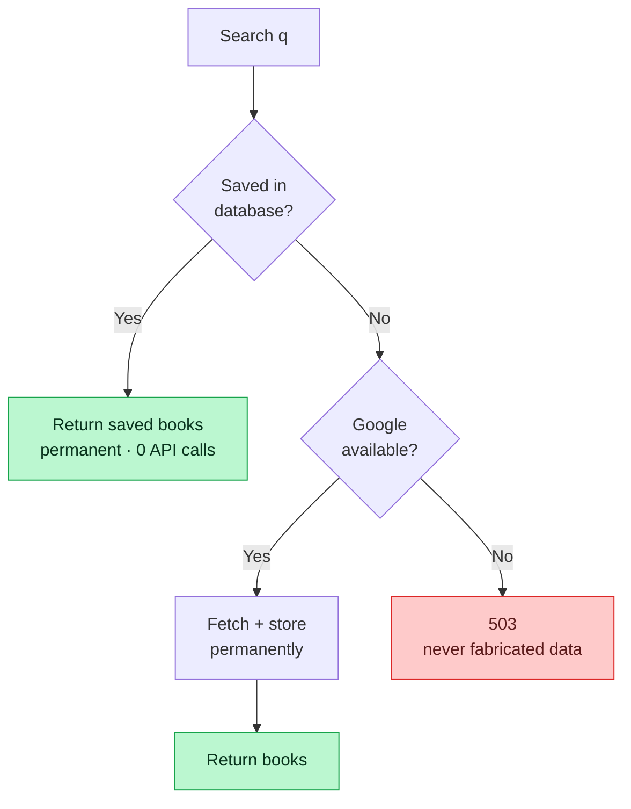
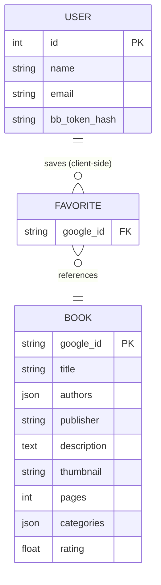
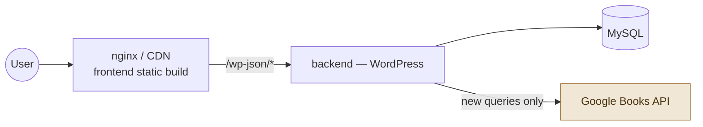

# Architecture

Full architecture of the **Book Platform** — a three-repository book discovery app:
a **React** frontend, a **WordPress** backend that *is* the API (the middle man), and
**Google Books** as the data source. Every diagram renders natively on GitHub (Mermaid).

**Repos:** `frontend` (React) · `backend` (WordPress + API) · `api` (this — spec, Swagger, docs)

---

## 1. The middle man (gateway)

The frontend never talks to Google. **The backend sits in the middle** — it decides,
stores, hides the API key, and serves clean data.

---

## 2. Component / container view

---

## 3. Three-repo map

Each box is an **independent Git repository** — built, tested, and deployed on its own.

---

## 4. Flow — Search

---

## 5. Flow — Book detail

---

## 6. Flow — Authentication

---

## 7. Backend internal pipeline (function-level)

---

## 8. Resilience

| Scenario | Result |
|----------|--------|
| Repeat search | Served from DB — **0 Google calls** |
| Google down, book previously saved | Still served |
| Google down, brand-new query | `503` — no fake data |
| API key removed | Everything already saved keeps working |

---

## 9. Data model

---

## 10. Deployment

See [How It Works](how-it-works.md) for a function-by-function breakdown, and the
[Swagger API Reference](swagger.md) for the live endpoint docs.
